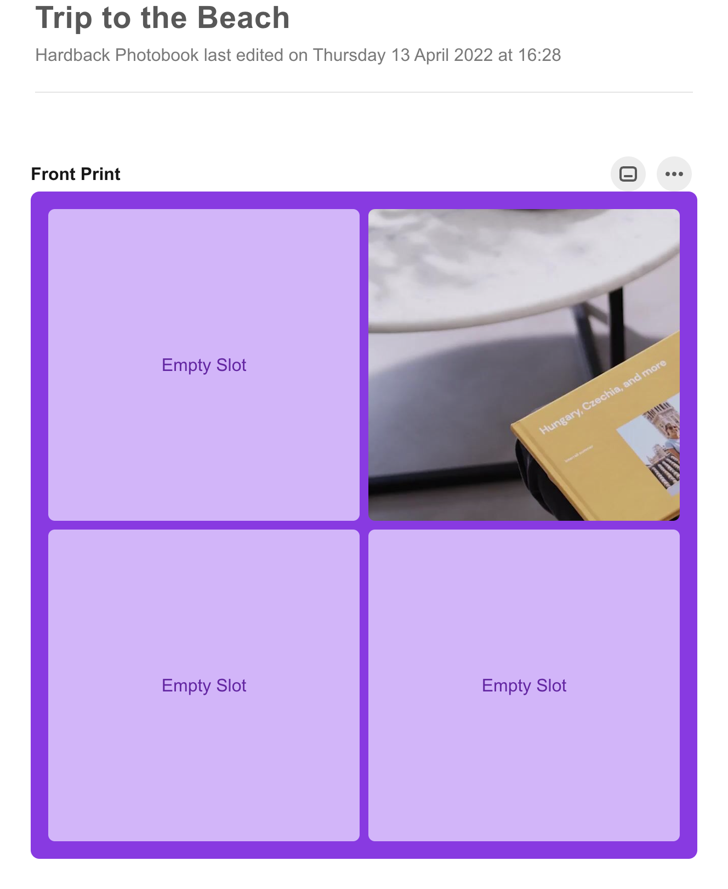

# Popsa Photo Book Application

Welcome to Popsa! This application is designed to simplify the process of creating personalised photo books. Whether you're capturing memories from a recent trip or compiling a collection of cherished moments, Popsa is here to help you bring your vision to life. With a focus on user-friendly design and dynamic content, the aim is to make the process both enjoyable and straightforward.

This application is built using Next.js, React, and styled-components, leveraging modern web technologies to deliver a seamless user experience.

**Live Link**: [Popsa App](https://popsa-app.vercel.app/)

## Preview



## Solution Overview

The Popsa Application is a web-based platform that allows users to create custom photo books. Key features include:

- A clean and intuitive interface for easy navigation
- Dynamic content that responds to user interactions
- Responsive design that works on both desktop and mobile devices
- A drag-and-drop image grid for photo arrangement
- A gallery view to preview the photo book

Using styled-components, the application maintains a consistent and customisable design system throughout.

## Current Implementation

### Tech Stack

- **Frontend**: React.js with Next.js framework
- **UI Components**: styled-components for a consistent and customisable design system
- **State Management**: React Hooks for local state management
- **Routing**: Next.js App Router for efficient page routing
- **Testing**: Jest and React Testing Library
- **Deployment**: Vercel for seamless deployment and hosting

### Key Features

- Drag and drop functionality for image arrangement
- Responsive design across all devices
- Server-side rendering with Next.js
- Component-based architecture
- Basic test coverage

## Areas for Improvement

### 1. TypeScript Integration

- Implement TypeScript for enhanced type safety
- Add type definitions for all components and utilities
- Improve code maintainability and catch errors early

### 2. Test

- Increase test coverage across components
- Add integration tests for critical user flows
- Implement end-to-end testing with Cypress or Playwright
- Add more comprehensive snapshot testing

### 3. State Management

- Evaluate and implement a more robust state management solution
- Consider Redux or Zustand for complex state logic
- Improve state organization and management patterns

### 4. Performance Optimization

- Implement lazy loading for images
- Optimize bundle size
- Add loading states and skeleton screens
- Implement proper error boundaries
- Add performance monitoring

### 5. Accessibility Improvements

- Conduct accessibility audit
- Implement ARIA labels and roles
- Improve keyboard navigation
- Ensure sufficient color contrast
- Add screen reader support

### 6. Code Quality

- Implement stricter ESLint rules
- Add Prettier for consistent code formatting
- Create coding style guide
- Improve component documentation
- Add JSDoc comments for better code documentation

### 7. Error Handling

- Implement comprehensive error handling
- Add error boundaries for component-level errors
- Improve error messaging and user feedback
- Add error tracking and monitoring

## Getting Started

To run this project locally, follow these steps:

1. Clone the repository:

```bash
git clone https://github.com/your-username/popsa-app.git
cd popsa-app
```

2. Install dependencies:

```bash
npm install
# or
yarn install
```

3. Run the development server:

```bash
npm run dev
# or
yarn dev
```

4. Open [http://localhost:3000](http://localhost:3000) with your browser to see the result.

Run the test suite:

```bash
npm run test
# or
yarn test
```

For test coverage:

```bash
npm run test:coverage
# or
yarn test:coverage
```

## Learn More

To learn more about the technologies used in this project, check out the following resources:

- [Next.js Documentation](https://nextjs.org/docs)
- [React Documentation](https://reactjs.org/docs/getting-started.html)
- [styled-components Documentation](https://styled-components.com/docs)
- [Jest Documentation](https://jestjs.io/)
- [React Testing Library](https://testing-library.com/react)

## Deployment

This project is deployed on Vercel. For more information on deploying your own Next.js app, refer to the [Next.js deployment documentation](https://nextjs.org/docs/app/building-your-application/deploying).

## Contributing

Contributions to improve the Popsa Application are welcome. Please feel free to submit issues and pull requests. Familiarity with styled-components will be beneficial for contributors.
